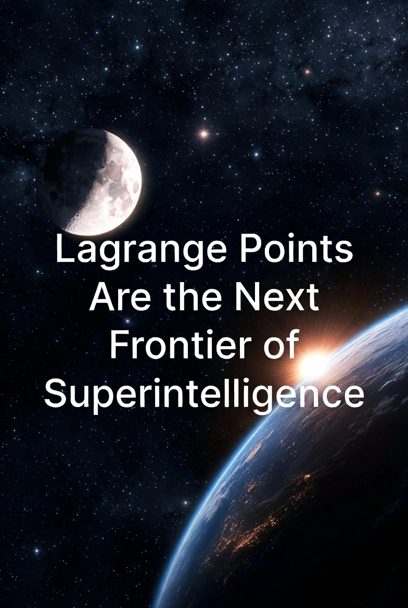

# Lagrange Points Are the Next Frontier of Superintelligence

Author: [Yifan Zhang](https://YFZ.ai) 

Date: February 4, 2026

 

To transcend the thermodynamic saturation of terrestrial infrastructure, we propose the Lagrange Compute Systems (LCS), a phased migration of superintelligence to the dynamically stable Earth-Moon and Sun-Earth L4/L5 (Lagrange-4/5) Trojan points.

This architecture circumvents the station-keeping costs of unstable orbits, establishing a scalable off-world framework for low-latency inference and massive-scale foundation model training.

Details can be found in [Lagrange_Superintelligence.pdf](https://yifanzhang-pro.github.io/lagrange-superintelligence/Lagrange_Superintelligence.pdf) 

## Citation

```bibtex
@article{zhang2026lagrange,
  title = {Lagrange Points Are the Next Frontier of Superintelligence},
  author = {Zhang, Yifan},
  journal = {yifanzhang-pro.github.io},
  year = {2026},
  month = {February},
  url = "https://github.com/yifanzhang-pro/lagrange-superintelligence"
}
```
